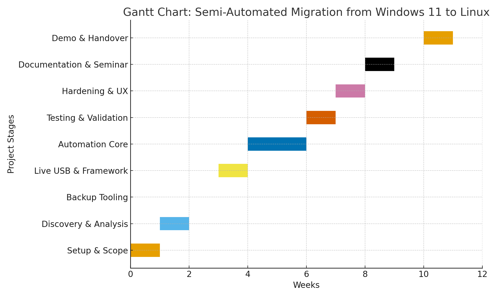

# Semi-Automated Migration from Windows 11 to Linux

Goal:
Design and implement a semi-automated framework to migrate user systems from Windows 11 to Linux Mint/Ubuntu using Ansible and Bash automation.

Success Metrics:
- ≥80 % of steps automated
- ≤15 min manual effort per system
- 0 data-loss incidents
- ≥90 % driver success rate

